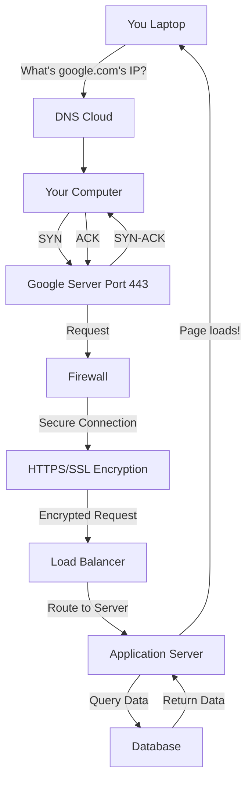

# **"What Happens When You Type google.com? A Visual Guide to the Web’s Hidden Journey"**

From DNS to databases, here’s how your browser loads a webpage in 8 steps—explained with a diagram you’ll actually understand.*

------

### **Introduction**

You type `https://www.google.com` and hit **Enter**. In less than a second, Google’s homepage appears. But behind this simple action lies a **high-speed relay race** involving DNS servers, firewalls, load balancers, and more. If you’ve ever wondered what *really* happens when you visit a website, this guide is for you.

As a software engineer, understanding this workflow is **critical**—whether you’re debugging slow page loads, designing APIs, or preparing for a technical interview. Let’s break it down **step by step**, with a diagram to visualize the process.

------

### **The 8-Step Journey of a Web Request**

#### **1. DNS Resolution: Translating Names to Numbers**

**What happens?** Your browser doesn’t understand words like "google.com"—it needs an **IP address** (e.g., `142.250.190.46`). This is where the **Domain Name System (DNS)** comes in.

**How it works:**

- Your browser checks its **cache** (recently visited sites).
- If not found, it asks your **ISP’s DNS resolver**, which queries:
  1. A **root nameserver** (for `.com`).
  2. A **TLD nameserver** (for `google.com`).
  3. Google’s **authoritative nameserver**, which returns the IP.

**Why it matters:**

- DNS is like the internet’s **phonebook**.
- A slow DNS lookup can delay page loads by **100ms+**.
- *Try it:* Run `dig google.com` in your terminal to see DNS in action!

------

#### **2. TCP/IP: Establishing a Connection**

**What happens?** Now that your browser knows Google’s IP, it needs to **connect** to the server using **TCP/IP**.

**How it works:**

- **TCP Handshake:** A 3-step process to ensure a reliable connection:
  1. Your computer sends a **SYN** packet.
  2. Google’s server replies with **SYN-ACK**.
  3. Your computer sends **ACK**—connection established!
- **IP Routing:** Your request hops across routers to reach Google.

**Analogy:** Like a phone call—you say "Hello?" (SYN), the other side responds "Hey!" (SYN-ACK), and you confirm "Let’s talk!" (ACK).

------

#### **3. Firewall: The Security Checkpoint**

**What happens?** Before your request reaches Google, it passes through **firewalls** (yours and Google’s).

**How it works:**

- Firewalls check:
  - Is the request from a **trusted source**?
  - Is the **port** (e.g., 443 for HTTPS) open?
  - Does the request match security rules?

**Why it matters:**

- Blocks **malicious traffic** (e.g., DDoS attacks).
- *Example:* If Google’s firewall detects suspicious activity, it blocks the request.

------

#### **4. HTTPS/SSL: Encrypting the Conversation**

**What happens?** Your browser and Google’s server **encrypt** their communication using **HTTPS/SSL**.

**How it works:**

1. Your browser requests Google’s **SSL certificate**.
2. The certificate is verified by a **Certificate Authority (CA)**.
3. A **session key** is generated to encrypt all data.

**Why it matters:**

- Prevents **eavesdropping** (e.g., hackers on public Wi-Fi).
- Browsers mark HTTP sites as "Not Secure."

------

#### **5. Load Balancer: Distributing the Work**

**What happens?** Google receives **millions of requests per second**. A **load balancer** distributes them across servers.

**How it works:**

- Routes traffic to the **least busy server**.
- Ensures **high availability** (if one server crashes, others take over).

**Why it matters:**

- Prevents **server overload** (ever seen a "503 Service Unavailable" error?).

------

#### **6. Web Server: Serving Static Files**

**What happens?** The **web server** (e.g., NGINX) handles your request.

**How it works:**

- Serves **static files** (HTML, CSS, JS) directly.
- For dynamic content (e.g., search results), it forwards the request to the **application server**.

**Why it matters:**

- Fast and lightweight for static content.

------

#### **7. Application Server: Generating Dynamic Content**

**What happens?** The **application server** (e.g., running Python or Java) processes dynamic requests.

**How it works:**

- Runs **business logic** (e.g., fetching your personalized search results).
- May query a **database** for data.

**Why it matters:**

- This is where the **core logic** of the website executes.

------

#### **8. Database: Storing and Retrieving Data**

**What happens?** For dynamic content, the app server queries a **database**.

**How it works:**

- The database returns data (e.g., search results).
- The app server **generates the HTML** and sends it back.

**Why it matters:**

- Databases store **petabytes of data** and use **indexes** for fast searches.

------

#### **9. Return Trip: Rendering the Page**

**What happens?** The response travels back to your browser, which **renders** the page.

**How it works:**

- Your browser builds the **DOM** (page structure).
- **CSS** styles the page, **JavaScript** adds interactivity.

------

### **Key Takeaways**

| Step               | Role                     | Example Tool           |
| ------------------ | ------------------------ | ---------------------- |
| DNS Resolution     | Translates names to IPs  | Cloudflare DNS         |
| TCP/IP             | Establishes connection   | Wireshark (to analyze) |
| Firewall           | Blocks malicious traffic | AWS WAF                |
| HTTPS/SSL          | Encrypts data            | Let’s Encrypt          |
| Load Balancer      | Distributes traffic      | NGINX                  |
| Web Server         | Serves static files      | Apache                 |
| Application Server | Runs business logic      | Django, Node.js        |
| Database           | Stores/retrieves data    | PostgreSQL, MySQL      |

## **Why This Matters for Your Career**

- **Frontend Devs:** Understanding DNS and TCP helps debug **slow page loads**.
- **Backend Devs:** Knowledge of load balancers and databases is **critical for scalability**.
- **DevOps/SRE:** Firewalls, HTTPS, and load balancing are **daily concerns**.
- **Interviews:** This question tests **fundamental knowledge**—ace it, and you’ll stand out.

------

## **Further Reading**

- [How DNS Works (Cloudflare)](https://www.cloudflare.com/learning/dns/)
- [TCP Handshake Explained (IBM)](https://www.ibm.com/cloud/learn/tcp-ip)
- [HTTPS Explained (Google)](https://developers.google.com/web/fundamentals/security/encrypt-in-transit/why-https)
- [Load Balancing 101 (NGINX)](https://www.nginx.com/resources/glossary/load-balancing/)

------

## **Call to Action**

- **Try it yourself:** Open Chrome DevTools (`F12` → **Network tab**) and reload `google.com`. Watch the steps unfold in real time!
- **Share this post** if it helped you understand the web better.
- **What surprised you?** Drop a comment below!

------

## **Conclusion**

Next time you visit a website, remember: what seems like magic is actually a **symphony of servers, protocols, and security layers** working together. Understanding this flow makes you a better developer—and a stronger candidate in technical interviews.
